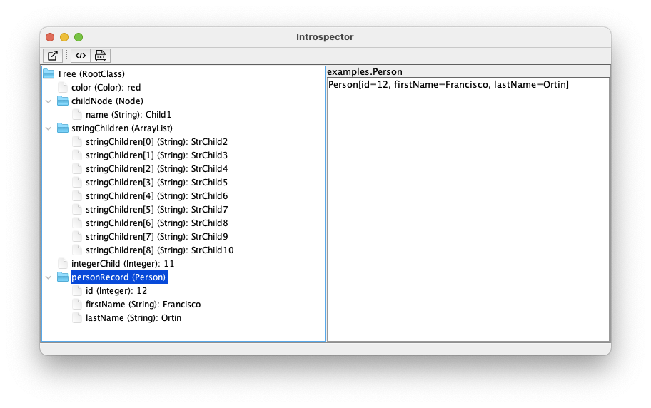
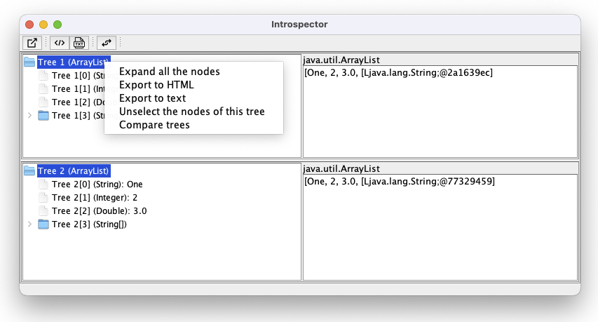

# Introspector

[](LICENSE)
[](https://github.com/francisco-ortin/introspector/releases)
[](https://francisco-ortin.github.io/Introspector/)


*A tool to visualize as trees runtime object structures of any application for the Java platform*.

Introspector is a general-purpose tool that visualizes runtime object structures as interactive trees by leveraging Java’s reflection
capabilities. It offers a lightweight, language-agnostic approach suitable for any application compiled
for the Java platform, requiring no source code and applicable to any object structure at runtime.

In addition to visualization, it can also be used programmatically as an API for comparing any pair
of object structures or the same structure over time, and for exporting those structures into text
and HTML files. It has been used in various research


## Download

Download the last .jar file from the [releases](https://github.com/francisco-ortin/Introspector/releases) section.

## Usage

Add the jar file to your classpath. Then, take any Java object (e.g., `myObject` reference) you want to visualize as a tree and
add the two following line:

``` Java
    new IntrospectorView("Introspector", "Tree", myObject);
```
 
A window like the following one will be displayed:



The previous window is shown for the following `IntrospectorDemo.java` 
program included in the `examples` package:

``` Java
package examples;
 
import introspector.Introspector;
import introspector.model.IntrospectorModel;
import introspector.view.IntrospectorView;
import java.util.List;
import java.util.ArrayList;

public class IntrospectorDemo {
    public static void main(String... args) {
        RootClass myObject = new RootClass();
        new IntrospectorView("Introspector", "Tree", myObject);
    }
}

enum Color {
    red, blue, green
}

class RootClass {
    private final Color color = Color.red;
    private final Node childNode = new Node("Child1");
    private final List<String> stringChildren = new ArrayList<>();
    private final int integerChild;
    private final Person personRecord;


    RootClass() {
        int i;
        for (i = 2; i <= 10; i++)
            this.stringChildren.add("StrChild" + i);
        this.integerChild = i;
        this.personRecord = new Person(12, "Francisco", "Ortin");
}

    @Override
    public String toString() {
        return "Root node";
    }
}

class Node {
    private final String name;
    
    Node(String name) { this.name = name; }
    
    @Override
    public String toString() { return this.name; }
}

record Person(int id, String firstName, String lastName) {}
``` 

### Using Introspector to compare two object structures

Introspector can also be used to compare two object structures. 
Alternatively, you can compare the same object structure in two different points of execution. 
What follows is an excerpt of the example `SameTreeComparisonOverTimeExample.java`:

``` Java
    List<Object> list = new ArrayList<>();
    list.add("One"); list.add(2); list.add(3.0);
    String [] array = {"Four", "Five", "Six"};
    list.add(array);
    // We must tell Introspector that the tree should be cloned; otherwise, the same tree would be shown twice
    // We do so by passing true as the third parameter (deepClone)
    IntrospectorModel tree1 = new IntrospectorModel("Tree 1", list, true);
    IntrospectorView view = new IntrospectorView("Introspector", tree1, false);
    // we now modify the tree
    array[1] = "Five modified";
    // the second one does not need to be cloned (otherwise, we would have to use IntrospectorModel("Tree 2", list, true))
    view.addTree("Tree 2", list);
    view.setVisible(true);
```

The previous code creates a list that is used to create an `IntrospectorModel` object.
The third parameter of the constructor is set to `true` to indicate that the tree should be cloned. 
That is because we want to compare the same tree at two different points of execution and Introspector shows real-time information of objects (we need to clone it).
Then, the tree is modified through the `array` object it is added to the view. Both trees are shown:



If we select the two trees to be compared, right-click, and select the option *Compare trees*, 
we will see the differences between the two trees highlighted in red:


### Using Introspector programmatically 

Introspector can also be used as an API to compare trees or to store a runtime object structure
into an HTML or txt file. To compare the `tree1` and `list` object structures in the previous example we write:

``` Java
    Introspector.compareTreesAsTxt(tree1, list, "out/output1.txt", "output2.txt");
    Introspector.compareTreesAsHtml(tree1, list, "out/output1.html", "full-output2.html");
```

The added, modified, and removed nodes are highlighted in red in the generated HTML files 
and between `**` in the txt files.

We can also store object data structures in HTML or txt files for the later analysis.
To store data structure pointed by the `myObject` reference, just write:

``` Java
    Introspector.writeTreeAsTxt(rootObject, "Tree", "output.txt");
    Introspector.writeTreeAsHtml(rootObject, "Tree", "output.html");
``` 


## Compilation

You can use maven to compile, test and package Introspector. Alternatively,
you can 
1. Copy the contents of `src/main/resources` folder into `src/main/java` and 
2. Go to the `src/main/java` directory and compile Introspector by:

``` Bash
    javac introspector/*.java
    javac examples/*.java
``` 

Then, you can run any example, just like:

``` Bash
    java examples.IntrospectorDemo
``` 

## Documentation

Check out the [reference documentation](https://francisco-ortin.github.io/Introspector/) of Introspector.


## License

[MIT license](LICENSE).

