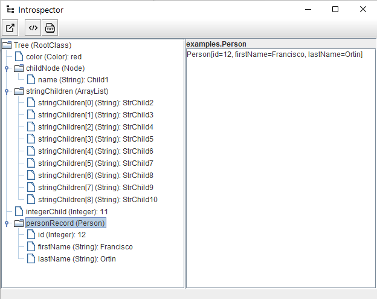

# Introspector

[](LICENSE)
[](https://github.com/francisco-ortin/introspector/releases)
[](https://francisco-ortin.github.io/Introspector/)


*A tool to visualize as trees the structure of runtime Java programs*.

Introspector is a Java tool that allows you to visualize any runtime structure of
Java objects as trees. By using introspection, the object state is presented together with
all the child objects included as fields inside the current node.

Introspector may be used as a Swing application to visualize object structures
or as an API to store the object structures as HTML or txt files.

## Usage

To run Introspector, just download the last .jar file from the
[releases](https://github.com/francisco-ortin/Introspector/releases)
section. Then, take any Java object you want to visualize as a tree and
add the two following lines:

``` Java
    TreeModel model = new IntrospectorModel("Tree", myObject);
    new IntrospectorView("Introspector", model);
```
 
A window like the following one will be displayed:



The previous window is shown for the following IntrospectorDemo.java 
program included in the *examples* package:

``` Java
package examples;
 
import introspector.Introspector;
import introspector.model.IntrospectorModel;
import introspector.view.IntrospectorView;
import java.util.List;
import java.util.ArrayList;

public class IntrospectorDemo {
    public static void main(String... args) {
        RootClass myObject = new RootClass();
        IntrospectorModel model = new IntrospectorModel("Tree", myObject);
        new IntrospectorView("Introspector", model);
    }
}

enum Color {
    red, blue, green
}

class RootClass {
    private final Color color = Color.red;
    private final Node childNode = new Node("Child1");
    private final List<String> stringChildren = new ArrayList<>();
    private final int integerChild;
    private final Person personRecord;


    RootClass() {
        int i;
        for (i = 2; i <= 10; i++)
            this.stringChildren.add("StrChild" + i);
        this.integerChild = i;
        this.personRecord = new Person(12, "Francisco", "Ortin");
}

    @Override
    public String toString() {
        return "Root node";
    }
}

class Node {
    private final String name;
    
    Node(String name) { this.name = name; }
    
    @Override
    public String toString() { return this.name; }
}

record Person(int id, String firstName, String lastName) {}
``` 

### Using Introspector as an API

Introspector can also be used as an API to store a runtime object structure
into an HTML or txt file. To store the object structure pointed by the 
`myObject` reference, just write:

``` Java
    Introspector.writeTreeAsTxt(rootObject, "Tree", "output.txt");
    Introspector.writeTreeAsHtml(rootObject, "Tree", "output.html");
``` 


## Compilation

You can use maven to compile, test and package Introspector. Alternatively,
you can 
1. Copy the contents of `src/main/resources` folder into `src/main/java` and 
2. Go to the `src/main/java` directory and compile Introspector by:

``` Bash
    javac introspector/*.java
    javac examples/*.java
``` 

Then, you can run any example, just like:

``` Bash
    java examples.IntrospectorDemo
``` 

## Documentation

Check out the [reference documentation](https://francisco-ortin.github.io/Introspector/) of Introspector.


## License

[MIT license](LICENSE).

